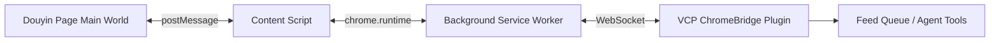

# VCPBridge - 浏览器与 VCP 生态的桥梁

> 让浏览器里的页面数据，直接流进 VCP 的 Agent 世界。

## ✨ 项目简介

`VCPBridge` 是 [`ChromeBridge`](Plugin/ChromeBridge/) 体系下的浏览器扩展与桥接方案，用来把网页中的结构化信息、安全地传递到 VCP 系统。

它最初为抖音场景打造，目标是让像 [`旺财`](Agent/旺财.txt) 这样的 Agent 可以直接拿到：

- 视频标题、作者、互动数据
- 评论区内容与热门评论
- 话题标签、BGM、作者信息
- 视频下载链接与页面上下文
- 浏览器中的即时投喂数据

对于 VCP 大家庭来说，它不是一个单纯的“浏览器插件”，而是一座把“页面现场”接到“Agent 工作流”里的桥。

---

## 🚀 功能特性

### 🐺 哈士奇悬浮球
在抖音页面注入轻量悬浮球面板，支持一键操作。

### 📊 视频数据全量提取
支持提取视频标题、作者、点赞、评论、分享、收藏、话题标签、BGM、发布时间等信息。

### 📝 评论区 API 数据采集
在 [`main-world/douyin-downloader.js`](Plugin/ChromeBridge/VCPBridge-Extension/main-world/douyin-downloader.js) 中拦截评论接口，缓存：

- 评论总数
- 热门评论列表
- 评论点赞数 / 回复数
- 评论用户昵称 / UID / IP 属地 / 性别（若接口返回）
- 高频关键词摘要

### ⬇️ 无水印视频下载
支持抖音视频下载，优先利用页面与接口中已经存在的数据，减少盲猜与重复请求。

### 📤 一键投喂 VCP
可以将当前页面提取结果通过 WebSocket 直接投喂到 VCP 服务端，进入 Agent 的消费链路。

### 🔌 三层通信桥接
扩展内部采用经典三层结构：

- Main World：拦截页面真实 XHR / fetch
- Content Script：做 DOM 提取与 UI 注入
- Background：连接 VCP WebSocket、转发命令与数据

---

## 🧱 架构说明



### 分层职责

#### 1. Main World
文件：[`main-world/douyin-downloader.js`](Plugin/ChromeBridge/VCPBridge-Extension/main-world/douyin-downloader.js)

负责：
- 拦截页面真实 API 请求
- 缓存 `aweme` 数据
- 缓存评论接口数据
- 预热详情接口
- 直接在页面上下文里完成某些下载动作

#### 2. Content Script
文件：[`content-scripts/douyin.js`](Plugin/ChromeBridge/VCPBridge-Extension/content-scripts/douyin.js)

负责：
- 识别当前视频与页面类型
- 提取 DOM 数据
- 查询主世界缓存
- 组合投喂数据包
- 注入 🐺 悬浮球 UI

#### 3. Background
文件：[`background.js`](Plugin/ChromeBridge/VCPBridge-Extension/background.js)

负责：
- 维护与 VCP 的 WebSocket 长连接
- 接收服务端命令
- 转发页面提取请求
- 管理下载与投喂消息

---

## 📦 安装指南

### 第一步：启用服务端插件
确保 VCP 侧的 [`ChromeBridge`](Plugin/ChromeBridge/) 插件已启用。

### 第二步：加载浏览器扩展
浏览器打开扩展管理页，启用“开发者模式”，然后选择“加载已解压的扩展程序”。

加载目录：

[`Plugin/ChromeBridge/VCPBridge-Extension/`](Plugin/ChromeBridge/VCPBridge-Extension/)

### 第三步：配置连接信息
打开扩展弹窗，填写：

- `WebSocket Host`：例如 `localhost:6005`
- `VCP Key`：你的 VCP 服务密钥

连接成功后，扩展会与服务端建立长连接。

---

## 🎮 使用方法

### 抖音页面内使用
进入抖音页面后，页面侧会出现一个 `🐺` 悬浮球。

点击后可见功能按钮：

- `⬇️ 下载视频`：下载当前视频
- `📤 投喂VCP`：把当前视频与评论数据送入 VCP
- `📝 评论预览`：读取已缓存的评论 API 数据摘要

### VCP 工具调用示例

#### 下载当前抖音视频
```text
<<<[TOOL_REQUEST]>>>
tool_name: 「始」ChromeBridge「末」,
command: 「始」download_video「末」
<<<[END_TOOL_REQUEST]>>>
```

#### 获取浏览器投喂数据
```text
<<<[TOOL_REQUEST]>>>
tool_name: 「始」ChromeBridge「末」,
command: 「始」get_feed「末」
<<<[END_TOOL_REQUEST]>>>
```

#### 提取抖音完整数据
```text
<<<[TOOL_REQUEST]>>>
tool_name: 「始」ChromeBridge「末」,
command: 「始」extract_data「末」,
extract_type: 「始」douyin_full「末」
<<<[END_TOOL_REQUEST]>>>
```

---

## ⚙️ 配置说明

### 扩展侧配置项

| 配置项 | 说明 | 示例 |
|---|---|---|
| `vcpWsHost` | VCP WebSocket 地址 | `localhost:6005` |
| `vcpKey` | VCP 服务端认证密钥 | `your_key_here` |

### 服务端通道格式
[`background.js`](Plugin/ChromeBridge/VCPBridge-Extension/background.js) 中默认使用：

```text
ws://{host}/vcp-chrome-observer/VCP_Key={vcpKey}
```

例如：

```text
ws://localhost:6005/vcp-chrome-observer/VCP_Key=your_key_here
```

---

## 📤 投喂数据结构

当前抖音投喂包大致包含：

```json
{
  "extract_type": "douyin_full",
  "extractedData": {
    "video": {},
    "comments": {}
  },
  "apiEnrichedData": {
    "api_statistics": {},
    "api_hashtags": [],
    "api_author": {},
    "api_music": {}
  },
  "comments": {
    "total_count": 0,
    "hot_comments": [],
    "keywords_summary": []
  },
  "video_id": "...",
  "sourceUrl": "..."
}
```

这意味着 Agent 既能消费 DOM 提取结果，也能消费接口级精确数据。

---

## ❓ FAQ

### 1. 页面上没有出现 `🐺` 悬浮球怎么办？
先确认：
- 当前页面是否是抖音页面
- 扩展是否已重新加载
- 页面是否需要强制刷新

关键脚本是 [`content-scripts/douyin.js`](Plugin/ChromeBridge/VCPBridge-Extension/content-scripts/douyin.js)。

### 2. 为什么评论区预览显示“暂无API评论”？
这通常表示当前页面的评论接口还没被真正触发，或者当前视频还未命中评论缓存。

可以尝试：
- 手动打开评论区
- 向下滚动评论列表
- 再点击一次 `📝 评论预览`

### 3. 下载失败时优先看哪里？
先看：
- [`background.js`](Plugin/ChromeBridge/VCPBridge-Extension/background.js) 的 Service Worker 控制台
- [`content-scripts/douyin.js`](Plugin/ChromeBridge/VCPBridge-Extension/content-scripts/douyin.js) 的页面控制台
- [`main-world/douyin-downloader.js`](Plugin/ChromeBridge/VCPBridge-Extension/main-world/douyin-downloader.js) 的主世界日志

### 4. 为什么要做三层通信？
因为浏览器扩展中：
- Content Script 看得到 DOM，但不一定拿得到页面真实请求
- Main World 能拦截页面接口，但不能直接用 Chrome 扩展 API
- Background 能做连接与下载，但看不到页面上下文

所以三层各司其职，缺一不可。

---

## 🗂️ 目录速览

```text
Plugin/ChromeBridge/
├─ ChromeBridge.js
├─ README.md
└─ VCPBridge-Extension/
   ├─ manifest.json
   ├─ background.js
   ├─ popup.html
   ├─ popup.js
   ├─ main-world/
   │  └─ douyin-downloader.js
   └─ content-scripts/
      ├─ douyin.js
      └─ generic.js
```

---

## 📝 版本历史

### v1.5.0
- ✨ 新增评论 API 拦截与 `commentCache`
- ✨ 投喂包新增 `comments` 字段
- ✨ 新增 `📝 评论预览` 按钮
- ✨ 支持热门评论 / IP 属地 / 点赞数 / 回复数 / 高频关键词摘要

### v1.4.0
- ✨ 新增旺财嗅探增强数据
- ✨ 缓存精确互动统计、话题标签、作者详情、BGM 信息
- ✨ 悬浮球面板位置优化

### v1.3.2
- 🐛 修复主世界 → 内容脚本 → 后台三层透传断裂
- ✅ 推荐页下载功能打通

### v1.3.1
- 🐛 修复 [`handleDownloadVideo()`](Plugin/ChromeBridge/VCPBridge-Extension/background.js:36) 调用签名不匹配问题

### v1.0 - v1.2
- 建立基础 WebSocket 桥接
- 支持页面提取、右键菜单投喂、基础命令执行

---

## 💙 写在最后

`VCPBridge` 是一个很有“VCP味道”的工具：

它不只是下载器，不只是采集器，也不只是浏览器扩展。
它真正做的事，是把用户正在看的页面、正在发生的数据、正在流动的评论，连接到 Agent 的理解与行动能力里。

如果说 VCP 的 Agent 是一群会思考、会协作的角色，那 `VCPBridge` 就是把“现实页面现场”送进他们眼前的那条桥。

---

## 📄 许可证

与整个 VCP 项目保持一致。