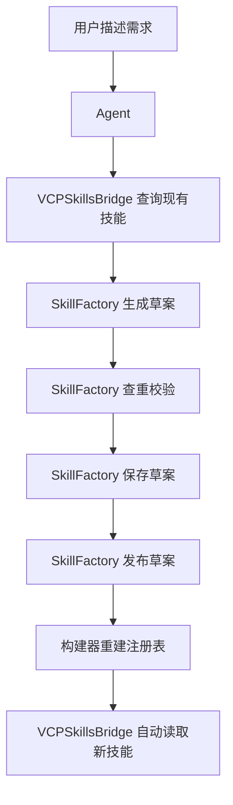

# SkillFactory 插件规格草案

## 1. 定位

[`SkillFactory`](../Plugin/VCPSkillsBridge/plugin-manifest.json) 的职责不是替代 [`VCPSkillsBridge`](../Plugin/VCPSkillsBridge/VCPSkillsBridge.js:1)，而是补上一个新的能力层：

- 让 Agent 能根据用户自然语言需求生成新的 skill
- 让 Agent 能对 skill 做结构化校验、查重、保存、发布
- 让 skill 的新增进入 VCP 的可审计注册链路

### 与现有模块分工

| 模块 | 职责 |
|---|---|
| [`Plugin/VCPSkillsBridge/VCPSkillsBridge.js`](../Plugin/VCPSkillsBridge/VCPSkillsBridge.js:1) | 查询、推荐、桥接已有 skill |
| `SkillFactory` | 生成、校验、保存、发布新的 skill |
| [`tools/build_skills_registry.py`](../tools/build_skills_registry.py) | 统一生成正式注册表 |
| [`routes/adminPanelRoutes.js`](../routes/adminPanelRoutes.js:24) | 提供草案与发布管理接口 |
| [`AdminPanel/js/skills-registry.js`](../AdminPanel/js/skills-registry.js:1) | 展示正式技能与草案审核区 |

---

## 2. 推荐目录结构

```text
Plugin/
  SkillFactory/
    plugin-manifest.json
    SkillFactory.js
    templates/
      skill.default.md
```

并新增数据目录：

```text
skills_registry/
  drafts/
  manifests/
  index.json
```

以及治理汇总文件：

```text
artifacts/skills_governance/
  local_skill_manifests.json
```

---

## 3. Agent 调用闭环



---

## 4. 插件 action 设计

### 4.1 `draft_skill_from_prompt`

用途：根据用户需求生成 skill 草案。

#### 输入

```json
{
  "action": "draft_skill_from_prompt",
  "user_goal": "我想让 Agent 在编码前先分析需求并列出风险和接口草图",
  "preferred_language": "zh",
  "target_module": ["AgentOrchestrator", "WorkflowEngine"],
  "style": "vcp_workflow"
}
```

#### 输出

```json
{
  "skill": {
    "skill_id": "vcp-local::pre-implementation-design",
    "name": "pre-implementation-design",
    "title": "编码前设计检查技能",
    "summary": "在实现前进行需求拆解、风险识别和接口草图梳理",
    "content": "# Skill\n\n## 目的\n...",
    "category": {
      "l1": "A. Agent工作流与任务编排",
      "l2": "A2. 执行调度与协同开发",
      "l3": "A2-1. 任务执行与协作流"
    },
    "capability_type": "核心能力",
    "priority": "P0",
    "status": "draft",
    "source_origin": "vcp-local",
    "language_hint": "zh",
    "vcp_mapping": ["AgentOrchestrator", "WorkflowEngine"],
    "trigger_mode": "manual_or_rule",
    "bridgeable": false,
    "tags": ["vcp-local", "P0", "设计前置"],
    "version": "0.1.0"
  }
}
```

### 4.2 `check_skill_overlap`

用途：检查重复、相似和冲突风险。

#### 输入

```json
{
  "action": "check_skill_overlap",
  "skill": {
    "name": "pre-implementation-design",
    "title": "编码前设计检查技能",
    "summary": "在实现前进行需求拆解、风险识别和接口草图梳理"
  }
}
```

#### 输出

```json
{
  "exact_matches": [],
  "similar_matches": [
    {
      "skill_id": "antigravity-awesome-skills-main::brainstorming",
      "reason": "与前置设计和需求梳理场景高度相关"
    }
  ],
  "risk_level": "medium",
  "suggestion": "建议保留为新 skill，但应强调接口草图与风险检查差异点"
}
```

### 4.3 `save_skill_draft`

用途：把 skill 草案写入 `drafts` 库。

#### 输入

```json
{
  "action": "save_skill_draft",
  "skill": {
    "skill_id": "vcp-local::pre-implementation-design",
    "name": "pre-implementation-design"
  }
}
```

#### 输出

```json
{
  "status": "saved",
  "draft_path": "skills_registry/drafts/vcp-local--pre-implementation-design.json"
}
```

### 4.4 `publish_skill_draft`

用途：把草案写入本地治理清单，进入可发布状态。

#### 输出结果建议包含：
- 发布状态
- 发布后 manifest 路径
- 是否已进入下轮 registry 构建

### 4.5 `rebuild_skills_registry`

用途：触发正式注册表重建。

#### 输出结果建议包含：
- 注册表版本
- 新增技能数量
- 重建时间
- 是否成功纳入目标 skill

---

## 5. 草案文件结构

建议每个草案存一个 JSON 文件。

### 示例路径

- `skills_registry/drafts/vcp-local--pre-implementation-design.json`

### 示例结构

```json
{
  "skill_id": "vcp-local::pre-implementation-design",
  "name": "pre-implementation-design",
  "title": "编码前设计检查技能",
  "summary": "在实现前进行需求拆解、风险识别和接口草图梳理",
  "content": "# Skill\n\n## 目的\n...",
  "category": {
    "l1": "A. Agent工作流与任务编排",
    "l2": "A2. 执行调度与协同开发",
    "l3": "A2-1. 任务执行与协作流"
  },
  "capability_type": "核心能力",
  "priority": "P0",
  "status": "draft",
  "source_origin": "vcp-local",
  "source_path": "skills_registry/drafts/vcp-local--pre-implementation-design.json",
  "language_hint": "zh",
  "vcp_mapping": ["AgentOrchestrator", "WorkflowEngine"],
  "trigger_mode": "manual_or_rule",
  "bridgeable": false,
  "tags": ["vcp-local", "P0", "设计前置"],
  "version": "0.1.0",
  "created_by": "agent",
  "created_at": "2026-03-07T00:00:00Z"
}
```

---

## 6. Skill content 模板建议

建议在 `templates/skill.default.md` 中固化模板：

```markdown
# Skill

## 目的

## 适用场景

## 输入

## 输出

## 执行步骤

## 决策规则

## 约束与风险

## 与 VCP 模块的关系
```

这样可保证 Agent 生成的 skill 至少满足最小结构。

---

## 7. 校验规则

### 7.1 字段校验

- `skill_id` 必须唯一
- `name` 必须为 kebab-case
- `title` 不可为空
- `summary` 不可为空
- `content` 不可为空
- `category.l1` 必须属于既有分类表
- `capability_type` 必须属于标准枚举
- `priority` 必须属于标准枚举

### 7.2 内容校验

- `content` 必须包含用途说明
- `content` 必须包含执行步骤
- `content` 长度不得低于最小阈值

### 7.3 治理校验

- 检查与 [`skills_registry/index.json`](../skills_registry/index.json) 的重复
- 检查与本地 drafts 的重复
- 检查是否映射到了合理的 `vcp_mapping`

---

## 8. 推荐发布策略

### 模式一：审核模式

- Agent 生成 skill
- 保存 draft
- 在 [`AdminPanel/js/skills-registry.js`](../AdminPanel/js/skills-registry.js:1) 的草案区等待人工确认
- 人工确认后发布

### 模式二：自动模式

- Agent 生成 skill
- 校验通过后自动发布
- 自动重建注册表

建议先做审核模式，再扩自动模式。

---

## 9. AdminPanel 需要配合的能力

建议后续在 [`AdminPanel/js/skills-registry.js`](../AdminPanel/js/skills-registry.js:1) 增加：

| 能力 | 用途 |
|---|---|
| 草案列表 | 查看 Agent 新建的草案 |
| 草案详情 | 查看 skill 正文与元数据 |
| 审核通过 | 发布 skill |
| 驳回 | 退回草案 |
| 重新构建 | 重建 registry |

---

## 10. 最小落地顺序

### 第一步

- 新建 `Plugin/SkillFactory/` 目录
- 定义 `plugin-manifest.json`
- 实现 `draft_skill_from_prompt`
- 实现 `save_skill_draft`

### 第二步

- 实现 `check_skill_overlap`
- 增加本地 drafts 存储
- 增加草案查询接口

### 第三步

- 实现 `publish_skill_draft`
- 扩展 [`tools/build_skills_registry.py`](../tools/build_skills_registry.py)
- 增加 registry 重建入口

---

## 11. 结论

`SkillFactory` 应被定义为 VCP 中的一个新型生产插件，而不是普通管理界面的附属功能。

其本质作用是：

> 让 Agent 具备把用户意图转化为标准化 skill 资产，并自动纳入 VCP 生态的能力。

这是 VCP 技能生态从“收录已有技能”走向“自生长技能系统”的关键一步。
