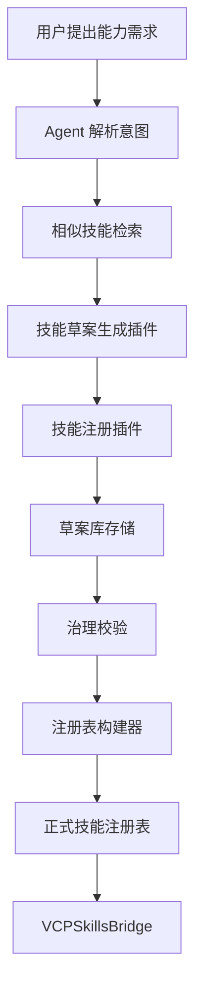

# VCP 技能新增与纳管功能规划

## 1. 当前进展检查

基于现状，VCP 已经完成了面向技能资产接入的第一阶段基础设施：

| 模块 | 当前状态 | 说明 |
|---|---|---|
| [`tools/build_skills_registry.py`](../tools/build_skills_registry.py) | 已完成 | 可从治理草案生成正式注册表 |
| [`skills_registry/index.json`](../skills_registry/index.json) | 已完成 | 当前作为技能统一目录源 |
| [`Plugin/VCPSkillsBridge/VCPSkillsBridge.js`](../Plugin/VCPSkillsBridge/VCPSkillsBridge.js) | 已完成 | 已具备查询、推荐、桥接占位执行能力 |
| [`routes/adminPanelRoutes.js`](../routes/adminPanelRoutes.js) | 已完成 | 已暴露技能注册表只读接口 |
| [`AdminPanel/js/skills-registry.js`](../AdminPanel/js/skills-registry.js) | 已完成 | 已支持技能浏览、筛选、详情查看 |

### 当前能力边界

当前系统已经具备：
- 看技能
- 查技能
- 推荐技能
- 桥接技能

当前系统还不具备：
- 由 Agent 根据用户目标自主撰写一个新技能
- 由 Agent 调用插件完成技能草案生成、字段补全、注册与发布
- 把“技能创建”纳入标准化的自动注册流水线
- 让 Agent 在创建前自动检索相似技能并避免重复

结论：

> 下一步不只是增加一个手工表单，而是要增加一个“Agent 驱动的技能生产插件链路”。

---

## 2. 目标重定义

结合你的新想法，推荐把该功能定义为：

**Agent 驱动型 skills 生成与注册系统**

也就是：
- 你只需要告诉 Agent 想要什么能力
- Agent 自动判断是否已有相似技能
- Agent 调用插件自主撰写 skill 草案
- Agent 调用注册插件完成纳管
- 必要时再进入人工审核或自动发布

这与单纯的“在后台点按钮新建 skill”不同，它更接近 VCP 生态中的一个原生能力闭环。

---

## 3. 推荐总架构

建议采用 **Agent + 注册插件 + 构建器** 的三层结构。



### 关键原则

1. Agent 负责理解需求与组织生成流程
2. 插件负责可审计的结构化写入与注册动作
3. 注册表仍然由构建器统一生成，不允许 Agent 直接硬改 [`skills_registry/index.json`](../skills_registry/index.json)

这样既保留了自主性，也保留了治理能力。

---

## 4. 为什么这种方式更适合 VCP

你的想法本质上是：

> 让 skill 本身成为 VCP 内部可以自我增长的资产。

这对 VCP 非常适合，原因有三点：

| 原因 | 说明 |
|---|---|
| 符合 Agent 生态 | VCP 本身就是多 Agent、多插件、多工作流架构 |
| 符合技能资产特点 | skill 主要是结构化知识与执行指引，适合由 LLM 生成初稿 |
| 符合治理需要 | 通过插件封装写入与注册动作，可以保留审计与校验 |

因此推荐目标不是做一个普通表单，而是做一个：

> **SkillFactory 能力链**

即一个专门负责“生成 skill、校验 skill、注册 skill”的能力组。

---

## 5. 建议拆成两个插件能力

### 5.1 插件一：技能草案生成器

建议新增一个专门插件，例如：
- `Plugin/SkillFactory/`
- 或在 [`Plugin/VCPSkillsBridge/`](../Plugin/VCPSkillsBridge/VCPSkillsBridge.js) 内扩展生成能力

更推荐独立成新插件，因为职责更清晰。

#### 建议能力

| action | 作用 |
|---|---|
| `draft_skill_from_prompt` | 根据用户需求生成技能草案 |
| `suggest_skill_metadata` | 生成分类、标签、优先级、映射建议 |
| `check_skill_overlap` | 检查与现有技能的重复或相似度 |
| `refine_skill_draft` | 对已有草案二次改写优化 |

#### 输入建议

```json
{
  "action": "draft_skill_from_prompt",
  "user_goal": "我想要一个技能，让 Agent 在开始写代码前先做需求拆解、风险排查和接口草图",
  "preferred_language": "zh",
  "style": "vcp_workflow",
  "target_module": ["AgentOrchestrator", "WorkflowEngine"]
}
```

#### 输出建议

```json
{
  "skill_id": "vcp-local::pre-implementation-design",
  "name": "pre-implementation-design",
  "title": "编码前设计检查技能",
  "summary": "在开始实现之前进行需求拆解、风险识别与接口草图设计",
  "content": "# Skill\n\n...",
  "category": {
    "l1": "A. Agent工作流与任务编排",
    "l2": "A2. 执行调度与协同开发",
    "l3": "A2-1. 任务执行与协作流"
  },
  "capability_type": "核心能力",
  "priority": "P0",
  "language_hint": "zh",
  "vcp_mapping": ["AgentOrchestrator", "WorkflowEngine"],
  "bridgeable": false,
  "tags": ["vcp-local", "P0", "设计前置"]
}
```

### 5.2 插件二：技能注册器

建议新增一个注册插件能力，负责把草案安全写入系统。

#### 建议能力

| action | 作用 |
|---|---|
| `save_skill_draft` | 保存技能草案到草案库 |
| `publish_skill_draft` | 将草案发布到治理链路 |
| `rebuild_skills_registry` | 重建正式注册表 |
| `register_skill_end_to_end` | 一次性执行保存、校验、发布、重建 |

这类动作不建议由 Agent 直接操作文件，而应统一通过插件能力完成。

---

## 6. 最推荐的实现方式

### 方案选择

| 方案 | 是否推荐 | 原因 |
|---|---|---|
| Agent 直接改 [`skills_registry/index.json`](../skills_registry/index.json) | 不推荐 | 会破坏构建器主导的注册表一致性 |
| Agent 直接写任意文件 | 不推荐 | 容易污染目录，缺少审计与校验 |
| Agent 调用“技能生成插件 + 注册插件” | 强烈推荐 | 自主性、可控性、可审计性最好 |

### 标准闭环

推荐闭环如下：

1. 用户描述想要的 skill
2. Agent 先调用现有 [`VCPSkillsBridge`](../Plugin/VCPSkillsBridge/VCPSkillsBridge.js) 做相似技能检索
3. 若无合适现成 skill，调用 `SkillFactory.draft_skill_from_prompt`
4. 生成草案后调用 `SkillFactory.check_skill_overlap`
5. 通过后调用 `SkillRegistrar.save_skill_draft`
6. 如策略允许，再调用 `publish_skill_draft`
7. 最后调用 `rebuild_skills_registry`
8. 新 skill 自动进入 [`skills_registry/index.json`](../skills_registry/index.json) 与桥接体系

---

## 7. 数据落点建议

### 7.1 草案库存

建议新增：
- `skills_registry/drafts/`

每个草案一个 JSON 文件，例如：
- `skills_registry/drafts/vcp-local--pre-implementation-design.json`

### 7.2 发布清单

建议新增：
- `artifacts/skills_governance/local_skill_manifests.json`

用于保存通过发布的本地 skill manifest。

### 7.3 正式注册表

仍由 [`tools/build_skills_registry.py`](../tools/build_skills_registry.py) 统一生成：
- [`skills_registry/index.json`](../skills_registry/index.json)

这样可以确保：
- 外部 skills 资产
- 本地新建 skills
- 治理筛选结果

最终都收敛到一个统一注册表。

---

## 8. Skill 草案的标准结构

建议 Agent 生成的 skill 草案至少包含：

| 字段 | 说明 |
|---|---|
| `skill_id` | 全局唯一 ID，建议 `vcp-local::name` |
| `name` | 小写 kebab-case |
| `title` | 展示名称 |
| `summary` | 简要说明 |
| `content` | skill 主体内容，Markdown |
| `category` | 三层分类 |
| `capability_type` | 核心/通用/支撑/扩展 |
| `priority` | P0/P1/P2 |
| `status` | `draft` / `reviewed` / `published` |
| `source_origin` | 固定 `vcp-local` |
| `language_hint` | `zh` / `en` |
| `vcp_mapping` | 目标模块 |
| `trigger_mode` | `manual_or_rule` 等 |
| `bridgeable` | 是否可桥接 |
| `tags` | 标签 |
| `version` | 版本号 |

### 建议 skill content 模板

```markdown
# Skill

## 目的

## 适用场景

## 输入

## 输出

## 执行步骤

## 决策规则

## 约束与风险

## 与 VCP 模块的关系
```

这样生成出的 skill 才真正可用于后续桥接或工作流内化。

---

## 9. Agent 需要的调用策略

为了让 Agent 自主撰写 skill 更稳定，建议定义一个固定策略。

### 建议策略

| 阶段 | Agent 动作 |
|---|---|
| 1 | 解析用户想要的能力 |
| 2 | 调用 [`list_skills`](../Plugin/VCPSkillsBridge/VCPSkillsBridge.js) / `recommend_skills` 检查现有技能 |
| 3 | 判断是复用、改写还是新建 |
| 4 | 调用 `draft_skill_from_prompt` 生成结构化草案 |
| 5 | 调用 `check_skill_overlap` 做重复检测 |
| 6 | 调用 `save_skill_draft` 保存 |
| 7 | 满足条件时调用 `publish_skill_draft` 与 `rebuild_skills_registry` |

### 发布策略建议

可分为两种模式：

| 模式 | 行为 |
|---|---|
| 审核模式 | Agent 生成后等待你确认再发布 |
| 自动模式 | 满足校验规则后直接注册 |

建议先从 **审核模式** 开始，再逐步开放自动模式。

---

## 10. 与 AdminPanel 的关系

如果采用 Agent 驱动方案，AdminPanel 不再只是手工录入页面，而是：

### AdminPanel 角色升级为

| 页面角色 | 说明 |
|---|---|
| 注册表浏览器 | 看正式技能 |
| 草案审查台 | 看 Agent 生成的技能草案 |
| 发布控制台 | 审核、发布、回滚 |
| 构建控制台 | 触发重建注册表 |

也就是说，AdminPanel 更适合做“审批与治理界面”，而 Agent 负责“生产动作”。

这与你的思路是高度一致的。

---

## 11. 对现有代码的影响建议

### 优先新增的能力点

| 改造点 | 建议 |
|---|---|
| [`Plugin/VCPSkillsBridge/VCPSkillsBridge.js`](../Plugin/VCPSkillsBridge/VCPSkillsBridge.js) | 保留查询桥职责，不建议塞入复杂生成逻辑 |
| 新建 `Plugin/SkillFactory/` | 推荐，负责生成与注册技能 |
| [`routes/adminPanelRoutes.js`](../routes/adminPanelRoutes.js) | 新增草案与发布 API |
| [`tools/build_skills_registry.py`](../tools/build_skills_registry.py) | 扩展支持本地 skill manifest 合并 |
| [`AdminPanel/js/skills-registry.js`](../AdminPanel/js/skills-registry.js) | 扩展为草案审查与发布界面 |

### 不建议的做法

- 不建议把“生成 skill”全部塞进 [`VCPSkillsBridge`](../Plugin/VCPSkillsBridge/VCPSkillsBridge.js)
- 不建议让 Agent 直接写正式注册表
- 不建议跳过重复检测与字段校验

---

## 12. 分阶段路线图

### 第一阶段

目标：先跑通 Agent 自动写技能草案

- 新建 `Plugin/SkillFactory/`
- 支持 `draft_skill_from_prompt`
- 支持 `check_skill_overlap`
- 支持 `save_skill_draft`
- 草案写入 `skills_registry/drafts/`

### 第二阶段

目标：跑通注册与发布

- 支持 `publish_skill_draft`
- 支持 `rebuild_skills_registry`
- 扩展 [`tools/build_skills_registry.py`](../tools/build_skills_registry.py) 合并本地发布清单
- AdminPanel 增加草案审核区

### 第三阶段

目标：让 Agent 具备半自动技能生态维护能力

- 支持从已有技能复制派生
- 支持自动标签建议
- 支持自动桥接建议
- 支持自动判断是新建 skill 还是复用旧 skill

---

## 13. 最终判断

你的想法是对的，而且比单纯加一个“新建按钮”更高级，也更符合 VCP 的方向。

最终推荐的实现定义是：

> **不是“手工新增 skills 功能”**
>
> 而是 **“Agent 调用 SkillFactory 插件自主生成并注册 skills 的能力”**

这样做的收益是：
- 你只管描述需求
- Agent 负责结构化产出
- 插件负责安全注册
- 构建器负责统一纳管
- 桥接层负责平台接入

这是一个完整的 VCP 内生技能增长闭环。

---

## 14. 下一步实施建议

最建议下一步直接落地以下规划项：

1. 设计 `Plugin/SkillFactory/` 的 `plugin-manifest.json`
2. 设计 `draft_skill_from_prompt` 与 `save_skill_draft` 两个首批 action
3. 新增 `skills_registry/drafts/` 草案存储层
4. 给 [`routes/adminPanelRoutes.js`](../routes/adminPanelRoutes.js) 增加草案查询接口
5. 扩展 [`AdminPanel/js/skills-registry.js`](../AdminPanel/js/skills-registry.js) 为草案审查页面

这将把当前体系从“技能展示与桥接”推进到“技能自主生产与注册”阶段。
