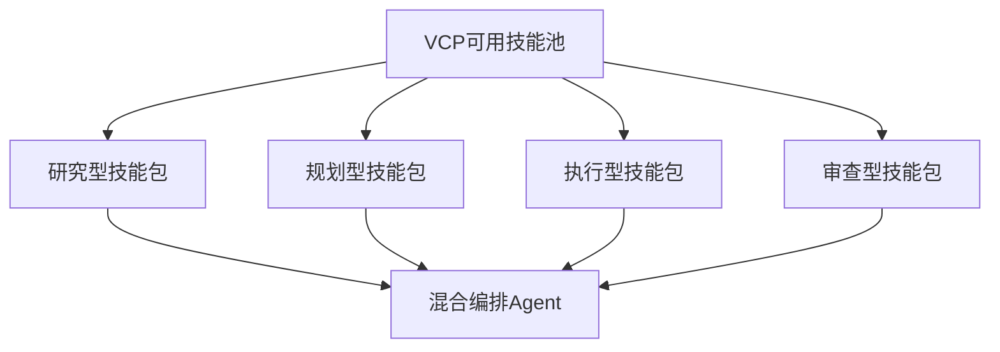

# VCP Skills 清理与分组计划书

## 1. 目标

本计划书用于指导外部技能库的清理、备份、VCP 兼容性筛选，以及后续面向不同 Agent 的技能分组与混合调用设计。

当前证据基础来自以下审计产物：
- [`plans/skills_source_audit.md`](plans/skills_source_audit.md)
- [`artifacts/skills_source_audit_detail.json`](artifacts/skills_source_audit_detail.json)
- [`artifacts/skills_library_source_distribution.json`](artifacts/skills_library_source_distribution.json)
- [`artifacts/skills_library_repo_breakdown.json`](artifacts/skills_library_repo_breakdown.json)
- [`artifacts/skills_library_cleanup_candidates.json`](artifacts/skills_library_cleanup_candidates.json)

本计划不直接在工作区内删除技能，只定义后续执行规则与结果结构。

---

## 2. 当前已确认事实

根据全库审计结果，外部技能库 [`H:/VCP/VCPzhangduan/VCPziliao/skills`](artifacts/skills_library_source_distribution.json) 当前存在以下来源分布：

- 总 `SKILL.md` 数量：2690
- 主来源 `primary_skills`：1612
- 镜像来源 `mirror_webapp`：906
- 文档变体 `docs_variant`：83
- 备份来源 `backup`：89

根据逐仓分解，主要清理负载集中在：
- `antigravity-awesome-skills-main` 的 `web-app/public/skills`
- `chiclaude-skills-main` 的 `skills-original-backup`
- `everything-claude-code-main` 的 `docs/skills`

这说明当前问题不是单个仓库污染，而是**多仓重复结构叠加**。

---

## 3. 清理总原则

### 3.1 保留原则

优先保留以下技能来源：

1. 原始 `skills/` 主目录来源
2. 同一 `skill_id` 下的中文主版本
3. 能被 VCP 当前桥接与注册表链路稳定消费的技能
4. 元信息完整、用途清晰、目录结构稳定的技能

### 3.2 转移到备份目录的原则

以下技能应优先转移到备份目录，而不是继续作为 VCP 主技能源：

1. `web-app/public/skills` 镜像副本
2. `skills-original-backup` 等历史备份副本
3. `docs/skills` 这类说明型或展示型文档副本
4. 同一 `skill_id` 的非中文重复版本，且已有中文主版本时
5. 缺少可被 VCP 利用的关键元信息、结构不稳定、仅适合其他框架消费的技能

### 3.3 暂缓处理原则

以下类型不直接移动，需在执行前复核：

1. 无中文版本但功能可能有价值的英文技能
2. 结构非标准但内容适合改造为 VCP skill 的技能
3. 名称冲突但语义并不完全重复的技能

---

## 4. VCP 可用性判定规则

### 4.1 可直接用于 VCP 的技能

若技能满足以下条件，可判定为 VCP 可用：

- 有明确任务边界
- 指令型内容可直接作为提示词或桥接能力说明
- 不依赖外部专有运行时才能发挥核心作用
- 可映射到 VCP 当前调用模式，例如：
  - 检索
  - 归纳
  - 规划
  - 验证
  - 执行编排
  - 文档生成

### 4.2 不适合直接用于 VCP 的技能

若技能存在以下情况，应转移到备份目录：

- 强绑定特定 Web UI 或特定 IDE 的界面流程
- 本质是镜像文档，不是稳定技能源
- 内容高度依赖宿主框架私有上下文注入机制
- 仅适用于演示或说明，不适合作为稳定技能单元
- 与现有保留技能相比完全重复且质量更低

### 4.3 建议增加的标签体系

为后续分组与路由，建议给保留技能增加以下标签：

- `vcp.search`
- `vcp.research`
- `vcp.plan`
- `vcp.execute`
- `vcp.verify`
- `vcp.review`
- `vcp.docs`
- `vcp.agent-core`
- `vcp.agent-optional`
- `vcp.hybrid-ready`

---

## 5. 备份策略

### 5.1 备份目标

在外部技能库下创建单独备份目录，用于收纳不适合当前 VCP 主链路使用的 skills，避免直接删除导致不可逆损失。

建议结构：

```text
H:/VCP/VCPzhangduan/VCPziliao/skills_backup/
├─ mirror_webapp/
├─ backup_sources/
├─ docs_variants/
├─ non_zh_duplicates/
└─ vcp_incompatible/
```

### 5.2 转移优先级

第一批优先转移：
1. `mirror_webapp`
2. `backup`
3. 明确不可用的 `docs_variant`

第二批转移：
1. 非中文重复版本
2. 明确不适合 VCP 调用模型的技能

第三批复核后决定：
1. 语义模糊但潜在可改造技能
2. 无中文版本但高价值技能

---

## 6. Agent 技能分组方案

后续保留下来的 VCP 可用技能，不应只做平铺注册，而应按调用逻辑分组，供不同 Agent 选择。

### 6.1 基础分组维度

建议先按能力维度分组：

1. 检索与发现
   - 搜索
   - 资料抓取
   - 线索扩展

2. 理解与归纳
   - 摘要
   - 提炼
   - 结构化信息整理

3. 规划与拆解
   - 计划书
   - 任务拆分
   - 实施顺序设计

4. 执行与编排
   - 多步骤执行
   - 工具衔接
   - 工作流组织

5. 校验与审查
   - 一致性检查
   - 风险检查
   - 质量复核

6. 输出与文档
   - 报告生成
   - 说明文档
   - 交付格式整理

### 6.2 面向 Agent 的技能包

建议后续形成以下 Agent 技能包：

#### A. 研究型 Agent
- 核心标签：`vcp.search` `vcp.research` `vcp.docs`
- 适用场景：资料查找、知识整理、问题背景构建

#### B. 规划型 Agent
- 核心标签：`vcp.plan` `vcp.research` `vcp.docs`
- 适用场景：方案设计、分步任务规划、交付清单生成

#### C. 执行型 Agent
- 核心标签：`vcp.execute` `vcp.agent-core`
- 适用场景：调用桥接技能、串联步骤、推动任务完成

#### D. 审查型 Agent
- 核心标签：`vcp.verify` `vcp.review`
- 适用场景：规则核查、输出验收、差异对比

#### E. 混合编排 Agent
- 核心标签：`vcp.hybrid-ready` `vcp.agent-core`
- 适用场景：将研究、规划、执行、复核多个技能包做组合调用

---

## 7. 混合调用设计原则

为了支持不同 Agent 混合调用 skills，建议采用以下规则：

1. 每个技能都要有主能力标签
2. 每个技能最多声明一个主分类和多个辅助分类
3. 混合调用时优先从核心技能包选取
4. 可选技能只在任务需要时追加
5. 避免把重复技能同时分配给多个 Agent 的核心包

建议形成如下关系：



---

## 8. 执行顺序

### 阶段 1
- 固化本计划书
- 明确备份目录结构
- 明确不可用于 VCP 的判定规则

### 阶段 2
- 创建备份目录
- 先转移高确定性的镜像、备份、说明型变体
- 产出迁移清单

### 阶段 3
- 对剩余技能做 VCP 可用性筛选
- 形成保留清单与转移清单

### 阶段 4
- 对保留技能补充分组标签
- 形成 Agent 技能包映射
- 为混合调用准备 registry 元信息

---

## 9. 风险与控制

### 9.1 主要风险

- 误移动高价值技能
- 把可改造技能误判为不可用
- 只按路径规则清理，忽略实际内容价值

### 9.2 控制措施

- 一律先转移到备份目录，不做永久删除
- 优先处理高确定性重复来源
- 对边界样本保留人工复核通道
- 为每批转移生成清单和统计结果

---

## 10. 下一步执行建议

当前最合理的下一步是：

1. 切换到实现模式
2. 在外部技能库创建备份目录
3. 先移动以下高确定性不可用来源：
   - `web-app/public/skills`
   - `skills-original-backup`
   - 明确说明型 `docs/skills`
4. 生成第一轮迁移报告
5. 再对剩余主来源进行 VCP 可用性分组

---

## 11. 本计划的输出目标

执行完成后，应最终产出：

- 一个清理后的 VCP 主技能池
- 一个外部备份技能池
- 一套可追踪的迁移记录
- 一份 Agent 技能包分组清单
- 一套支持混合调用的技能标签结构
