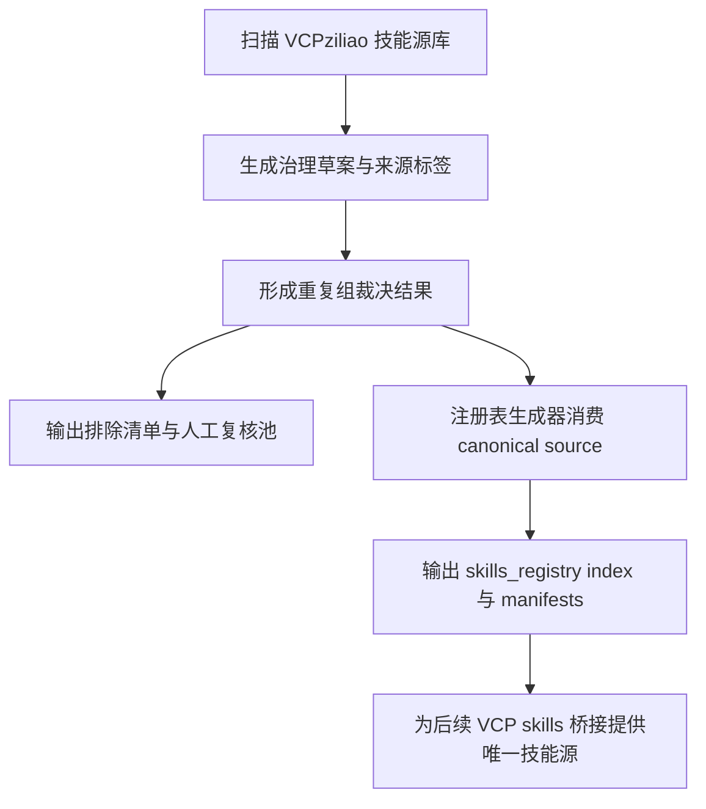

# VCP Skills 双层去重执行计划

## 1. 本次目标

本计划面向两层并行治理：

1. 上游源库层：[`VCPziliao/skills`](../VCPziliao/skills)
2. 下游注册表层：[`VCPToolBox/skills_registry/index.json`](../skills_registry/index.json) 与 [`VCPToolBox/skills_registry/manifests/`](../skills_registry/manifests)

目标不是立即删除所有重复技能，而是先建立一套可以稳定复用的去重规则、审计产物与生成链路，使后续 VCP skill 接入基于“唯一主版本”推进。

---

## 2. 已读取的现有依据

本计划建立在以下现有材料之上：

- [`VCPToolBox/docs/SKILLS_REGISTRY_INTEGRATION_PLAN.md`](../docs/SKILLS_REGISTRY_INTEGRATION_PLAN.md)
- [`VCPToolBox/plans/vcp_skills_cleanup_and_grouping_plan.md`](./vcp_skills_cleanup_and_grouping_plan.md)
- [`VCPToolBox/plans/skills_source_audit.md`](./skills_source_audit.md)
- [`VCPToolBox/tools/build_skills_registry.py`](../tools/build_skills_registry.py)
- [`VCPToolBox/tools/skills_governance.py`](../tools/skills_governance.py)

当前已经具备：

- 注册表生成脚本已有基础去重逻辑
- 现有规则已明确偏向原始 `skills/` 路径
- 已有中文优先、镜像排除、备份排除的治理方向
- 但上游源库和下游注册表之间还没有形成一条完整的双层去重闭环

---

## 3. 双层去重的核心思路

### 3.1 上游源库层去重

目标：在 [`VCPziliao/skills`](../VCPziliao/skills) 中为每个候选 skill 选出唯一主来源，并把其他来源标记为排除或复核对象。

这一层回答的问题是：

- 同一个 skill 到底保留哪一个目录来源
- 哪些是镜像、备份、docs 变体
- 哪些属于中文主版本，哪些只是语言重复项
- 哪些虽然重复，但不能自动剔除，需要人工复核

### 3.2 下游注册表层去重

目标：确保 [`VCPToolBox/skills_registry/index.json`](../skills_registry/index.json) 中每个 `skill_id` 只有一个稳定条目，并且该条目引用的是上游已确认的主来源。

这一层回答的问题是：

- 正式注册表不再吸收多个冲突来源
- 注册表去重规则不再只是“被动排序选一个”，而是尽量消费上游已裁决结果
- 重复解析过程可审计、可复算、可回溯

---

## 4. 去重判定规则

### 4.1 主保留规则

同一 `skill_id` 或同一语义技能组出现多个候选来源时，优先顺序建议固定为：

1. 原始 `skills/` 主目录来源
2. 中文主版本
3. 元信息更完整的版本
4. 摘要更完整、标题更稳定的版本
5. 路径更短、更标准、更接近仓库主技能结构的版本

### 4.2 应排除规则

以下来源默认列为排除候选：

1. `web-app/public/skills/`
2. `skills-original-backup/`
3. 已存在中文主版本时的非中文版本
4. 与主来源内容等价的 `docs/.../skills/...` 镜像副本
5. 明显为发布产物、演示副本、历史快照的目录

### 4.3 进入人工复核池的规则

以下来源不应自动删除或自动排除，而应进入复核清单：

1. `docs/.../skills/...` 中找不到对应原始主来源的技能
2. `language_hint = unknown` 且位于原始 `skills/` 目录的技能
3. 同名但内容可能不同、不能视为简单重复的技能
4. 中文版本存在但质量明显低于英文版本的技能
5. 路径结构异常、无法自动归类为主来源或镜像来源的技能

---

## 5. 建议新增与调整的产物

### 5.1 上游审计产物

建议在治理链路中新增或强化以下产物：

- `artifacts/skills_governance/skills_dedup_source_report.json`
- `artifacts/skills_governance/skills_dedup_source_report.md`
- `artifacts/skills_governance/skills_manual_review_queue.json`
- `artifacts/skills_governance/skills_excluded_sources.json`

这些产物分别承担：

- 每个重复组的全部来源清单
- 最终保留项与排除原因
- 待人工判断的来源池
- 被排除来源的审计记录

### 5.2 下游注册表产物

建议补强以下输出：

- [`VCPToolBox/skills_registry/index.json`](../skills_registry/index.json) 中增加更明确的去重来源说明
- `skills_registry/manifests/*.json` 继续只保留主来源 manifest
- 新增 `artifacts/skills_governance/registry_dedup_resolution.json`

这样可以把“上游裁决”和“下游最终注册结果”分开存档。

---

## 6. 建议调整的脚本职责

### 6.1 [`VCPToolBox/tools/skills_governance.py`](../tools/skills_governance.py)

建议增强为“上游去重治理总入口”，新增职责：

1. 识别重复来源组
2. 给每条来源打标签
   - `primary_skills`
   - `mirror_webapp`
   - `backup`
   - `docs_variant`
   - `non_zh_when_zh_exists`
   - `language_unknown`
3. 为每个重复组输出：
   - 推荐保留项
   - 排除项
   - 复核项
4. 输出供注册表消费的标准化去重裁决文件

### 6.2 [`VCPToolBox/tools/build_skills_registry.py`](../tools/build_skills_registry.py)

建议从“直接排序选优”改为“优先消费上游裁决”：

1. 先读取治理阶段生成的去重裁决文件
2. 若某个 `skill_id` 已有 canonical source，则直接使用
3. 若没有裁决，再回退到脚本内排序逻辑
4. 输出更详细的 `duplicateReport`
   - `selected_source_path`
   - `selection_reason`
   - `excluded_candidates`
   - `manual_review_candidates`

### 6.3 是否需要新脚本

建议增加一个专用脚本，例如：

- `tools/skills_source_deduplicator.py`

职责只做一件事：

- 从治理草案或 inventory 中抽取重复组
- 生成结构化去重裁决结果
- 不直接写注册表

这样可以让：

- [`tools/skills_governance.py`](../tools/skills_governance.py) 负责治理草案
- `tools/skills_source_deduplicator.py` 负责来源去重裁决
- [`tools/build_skills_registry.py`](../tools/build_skills_registry.py) 负责正式注册表输出

三者职责边界更清晰。

---

## 7. 推荐执行顺序

### 第一步：锁定重复判定键

优先采用两种键并行：

1. `skill_id`
2. `duplicate_group` 或基于仓库名加技能名的稳定组键

目的：避免只依赖目录名，导致语义重复无法收敛。

### 第二步：先做来源分类，不做物理删除

先把所有候选来源分成三类：

1. 保留
2. 排除
3. 人工复核

当前阶段不直接移动或删除 [`VCPziliao/skills`](../VCPziliao/skills) 文件，只输出裁决与清单。

### 第三步：让注册表生成链路引用 canonical source

保证注册表只从“保留来源”里选技能，而不是每次临时排序挑一个。

### 第四步：再决定是否物理清理上游目录

等审计结果稳定后，再决定是否把排除来源转移到备份目录，例如：

- `VCPziliao/skills_backup/mirror_webapp/`
- `VCPziliao/skills_backup/backup_sources/`
- `VCPziliao/skills_backup/docs_variants/`
- `VCPziliao/skills_backup/non_zh_duplicates/`

---

## 8. 面向实现模式的 todo

以下清单适合后续切换到实现模式直接执行：

- [ ] 复核 [`artifacts/skills_governance/skill_manifests_draft.json`](../artifacts/skills_governance/skill_manifests_draft.json) 是否已包含去重所需字段，如 `duplicate_group` 与 `language_hint`
- [ ] 设计 `canonical / excluded / manual_review` 三态来源裁决数据结构
- [ ] 在治理链路中新增来源分类与重复组裁决输出
- [ ] 为 `docs_variant` 与 `language_unknown` 增加明确复核原因字段
- [ ] 调整 [`tools/build_skills_registry.py`](../tools/build_skills_registry.py) 使其优先读取 canonical source 裁决
- [ ] 扩展注册表 `duplicateReport` 字段，保留排除原因与回退原因
- [ ] 生成一版新的 [`skills_registry/index.json`](../skills_registry/index.json) 以验证去重结果是否唯一稳定
- [ ] 抽样检查高频重复仓库，例如 `antigravity-awesome-skills-main`、`chiclaude-skills-main`、`everything-claude-code-main`
- [ ] 确认无误后，再规划上游源库物理清理或转移到 `skills_backup/`

---

## 9. 本次规划结论

本次最合适的推进方式不是直接改某一个文件，而是先把“双层去重闭环”确定下来：

1. 上游源库负责产出唯一主来源裁决
2. 下游注册表负责消费裁决并生成唯一正式条目
3. 排除项与复核项单独沉淀为审计产物
4. 物理清理延后到规则稳定之后

这样做的好处是：

- 去重规则不会只藏在注册表脚本内部
- 上游与下游职责分离，后续更容易维护
- 为你后面真正做 VCP skills 接入提供唯一、稳定、可追溯的技能主版本基础
