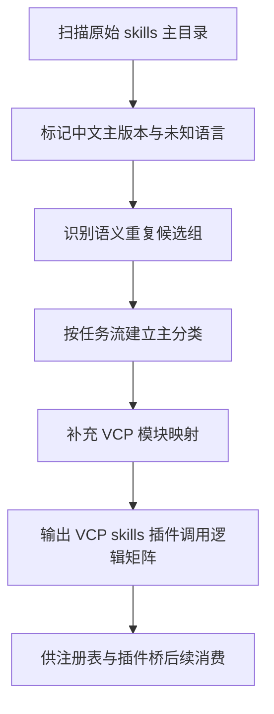

# VCP Skills 第二轮精细去重与插件调用逻辑分类计划

## 1. 本轮目标

在首批镜像、备份、docs 变体迁移完成后，第二轮只聚焦原始 `skills/` 主目录内部的可用技能梳理，核心目标有两件事：

1. 继续做精细去重
   - 中文主版本优先
   - 未知语言来源复核
   - 语义重复技能归并
2. 按 VCP skills 插件调用逻辑建立稳定分类
   - 先按任务流主分类
   - 再补 VCP 模块映射

本轮不直接删除主目录技能，而是先产出一套可供后续实现模式执行的判定表、分类表和调用逻辑图。

---

## 2. 第二轮处理范围

处理对象限定为首批迁移后仍保留在原始 `skills/` 主目录中的技能来源，重点关注：

- 中文与非中文并存的主目录技能
- `language_hint = unknown` 的主目录技能
- 名称不同但能力语义高度相近的技能
- 可被 VCP 插件桥接消费的技能
- 不适合 VCP 插件调用、但可保留为参考资料的技能

---

## 3. 第二轮去重规则

### 3.1 中文主版本规则

同一技能组若同时存在中文与非中文主目录版本：

1. 中文版本作为 VCP 主版本优先候选
2. 非中文版本进入重复候选池
3. 若中文版本质量明显不足，则标为人工复核，不自动淘汰英文版
4. 正式注册表中同一技能组只保留一个主版本

### 3.2 未知语言规则

对 `language_hint = unknown` 的主目录技能：

1. 先不迁移出主目录
2. 建立单独复核池
3. 根据标题、正文结构、示例内容补充语言判定
4. 若可确认适合 VCP 使用，则进入保留池
5. 若仅是资料型文档，则标为参考型而非桥接型 skill

### 3.3 语义重复规则

以下情况视为语义重复候选，而不是立即删除：

1. 名称不同，但任务边界相同
2. 都提供同类工作流，只是表达方式不同
3. 都服务于同一类插件调用动作，例如：
   - 搜索检索
   - 计划拆解
   - 质量校验
   - 审查复核
   - 输出整理

语义重复候选需输出：

- 主 skill
- 替代 skill
- 相同点
- 差异点
- 推荐保留原因

---

## 4. VCP Skills 插件调用逻辑主分类

本轮分类不按仓库来源分，而按插件调用时的任务流职责分。

### 4.1 主分类一：检索与发现

插件调用目标：补充背景、抓取线索、形成候选信息。

典型动作：
- 搜索
- 检索增强
- 多轮资料发现
- 主题扩展

建议 VCP 标签：
- `vcp.search`
- `vcp.research`
- `vcp.discovery`

可映射技能类型：
- `search-first`
- `iterative-retrieval`
- 市场研究类
- wiki 研究类

### 4.2 主分类二：理解与归纳

插件调用目标：把检索结果整理成结构化认知。

典型动作：
- 摘要
- 提炼
- 比较
- 结构化整理

建议 VCP 标签：
- `vcp.summarize`
- `vcp.structure`
- `vcp.analysis`

### 4.3 主分类三：规划与拆解

插件调用目标：把任务转成步骤、清单、执行方案。

典型动作：
- 写计划
- 分解任务
- 生成路线
- 设定执行顺序

建议 VCP 标签：
- `vcp.plan`
- `vcp.breakdown`
- `vcp.workflow-design`

典型技能：
- `writing-plans`
- 工作流设计类
- 架构方案类

### 4.4 主分类四：执行与编排

插件调用目标：把步骤串起来，驱动工具或子步骤推进。

典型动作：
- 任务编排
- 多步执行
- 工具接力
- 子代理协作

建议 VCP 标签：
- `vcp.execute`
- `vcp.orchestrate`
- `vcp.agent-core`

### 4.5 主分类五：验证与审查

插件调用目标：在执行前后做检查、复核、风险控制。

典型动作：
- 验证
- 安全审查
- 调试
- 结果核验

建议 VCP 标签：
- `vcp.verify`
- `vcp.review`
- `vcp.debug`
- `vcp.security`

典型技能：
- `verification-loop`
- `verification-before-completion`
- `security-review`
- `systematic-debugging`

### 4.6 主分类六：输出与交付

插件调用目标：把结果整理成可交付内容。

典型动作：
- 报告生成
- 交付说明
- 文档整理
- 内容成品化

建议 VCP 标签：
- `vcp.docs`
- `vcp.delivery`
- `vcp.report`

---

## 5. VCP 模块映射层

在任务流主分类之外，每个 skill 还要补一层 VCP 模块映射，用于插件桥和注册表联动。

### 5.1 模块映射建议

| VCP 模块 | 作用 | 适合接的 skill 类型 |
|---|---|---|
| `KnowledgeBase` | 信息检索与知识补充 | 检索、研究、资料整理 |
| `WorkflowEngine` | 任务编排与步骤推进 | 规划、执行、编排 |
| `QualityGate` | 质量校验与风险控制 | 验证、复核、安全审查 |
| `PluginBridge` | 技能查询、推荐、占位执行 | 全部桥接型 skill |
| `AdminPanel` | 注册表展示与管理 | 分类标签、状态、优先级展示 |

### 5.2 一项 skill 的双层映射示例

例如 `search-first`：

- 任务流主分类：检索与发现
- VCP 模块映射：`KnowledgeBase` + `PluginBridge`
- 调用方式：先返回检索策略，再交给上层链路继续执行

例如 `verification-loop`：

- 任务流主分类：验证与审查
- VCP 模块映射：`QualityGate` + `PluginBridge`
- 调用方式：返回验证清单与建议检查项

例如 `writing-plans`：

- 任务流主分类：规划与拆解
- VCP 模块映射：`WorkflowEngine` + `PluginBridge`
- 调用方式：返回任务拆解模板与计划输出结构

---

## 6. 第二轮输出清单

建议下一步至少形成以下结构化产物：

- `plans/skills_round2_language_review.md`
- `plans/skills_round2_semantic_duplicates.md`
- `plans/skills_vcp_call_logic_matrix.md`
- `artifacts/skills_governance/skills_round2_review_queue.json`
- `artifacts/skills_governance/skills_semantic_duplicate_groups.json`

这些产物分别回答：

1. 哪些是中文主版本保留项
2. 哪些是未知语言待复核项
3. 哪些是语义重复候选组
4. 每个 skill 属于哪个任务流主分类
5. 每个 skill 对应哪些 VCP 模块与桥接方式

---

## 7. 推荐执行顺序

---

## 8. 面向实现模式的 todo

- [ ] 从当前保留的原始 `skills/` 主目录中抽取中文、非中文、未知语言清单
- [ ] 为中文和非中文共存技能建立主版本判定表
- [ ] 为 `language_hint = unknown` 建立人工复核表
- [ ] 建立语义重复候选分组并给出推荐保留 skill
- [ ] 给每个保留 skill 标注任务流主分类
- [ ] 给每个保留 skill 标注 `KnowledgeBase`、`WorkflowEngine`、`QualityGate`、`PluginBridge`、`AdminPanel` 模块映射
- [ ] 输出面向 VCP skills 插件桥的调用逻辑矩阵
- [ ] 再决定哪些主目录 skill 应保留为桥接型，哪些应降级为参考型

---

## 9. 本轮结论

第二轮不再做粗清理，而是做“主目录内部治理”。

核心原则是：

1. 去重不只看路径，还要看语言主版本与语义角色
2. 分类不只服务注册表，还要服务 VCP skills 插件调用逻辑
3. 每个 skill 最终都应同时拥有：
   - 一个任务流主分类
   - 一组 VCP 模块映射
   - 一个是否适合桥接调用的结论

这样整理后，后续不管是做 [`skills_registry/index.json`](../skills_registry/index.json) 扩展，还是做 skills 插件桥，都能直接消费同一套分类与裁决结果。